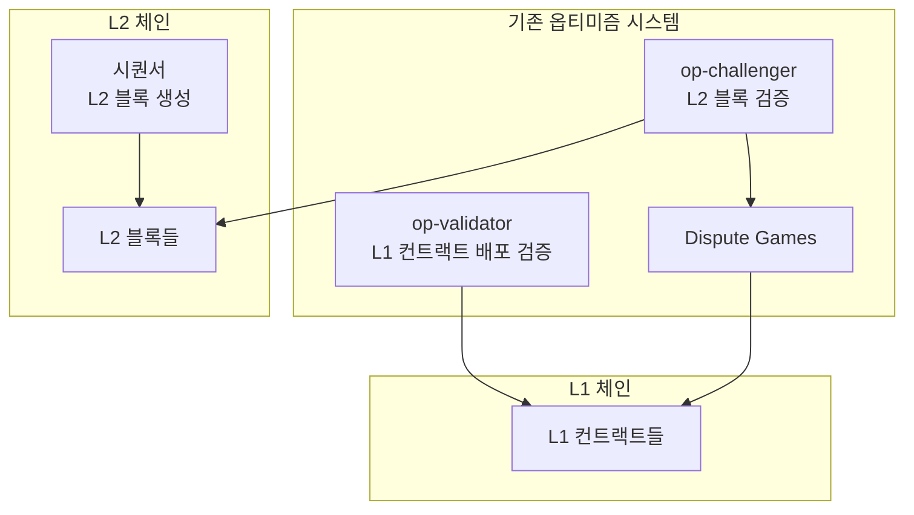
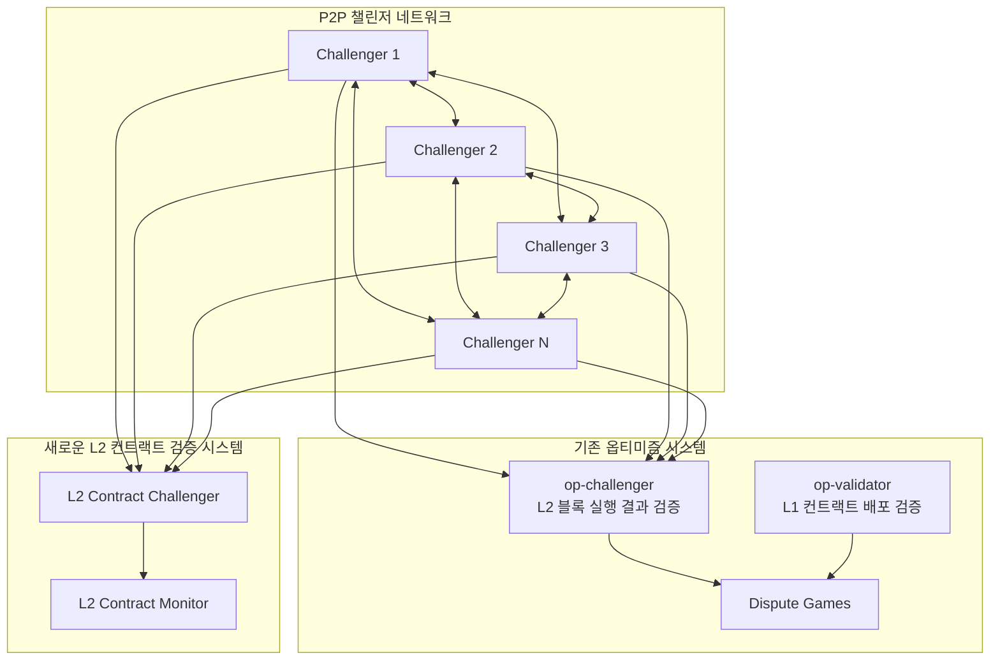

# Optimism 챌린저 시스템 종합 가이드

## 📋 **목차**
1. [핵심 질문과 답변](#핵심-질문과-답변)
2. [기존 옵티미즘 챌린저 시스템](#기존-옵티미즘-챌린저-시스템)
3. [현재 시스템의 한계](#현재-시스템의-한계)
4. [제안: P2P 챌린저 관리 시스템](#제안-p2p-챌린저-관리-시스템)
5. [구현 로드맵](#구현-로드맵)
6. [결론](#결론)

## 🎯 **핵심 질문과 답변**

### **Q1: 옵티미즘의 챌린저는 무엇을 검증하는가?**
**A**:
- **op-validator**: **L1 컨트랙트 배포** 검증 (배포/업그레이드 시점)
- **op-challenger**: **L2 블록 실행 결과** 검증 (실시간 모니터링)
- **중요**: 현재 시스템에서는 **L2 컨트랙트 자체 검증**을 수행하지 않음

### **Q2: op-validator와 op-challenger는 서로 연관되어 있는가?**
**A**: **아니요, 완전히 독립적입니다.**
- **실행 시점**: op-validator는 필요시, op-challenger는 지속적
- **검증 대상**: L1 컨트랙트 vs L2 블록 실행 결과
- **연동 관계**: 직접적인 데이터 교환 없음

### **Q3: 현재 시스템의 가장 큰 문제점은?**
**A**:
1. **고정 주소 제한**: 2개의 고정된 주소만 챌린저로 참여 가능
2. **L2 컨트랙트 검증 부재**: L2 컨트랙트 자체 검증 기능 없음
3. **중앙화된 권한**: 챌린저 품질 관리 메커니즘 부재
4. **확장성 제한**: 새로운 챌린저 추가 시 컨트랙트 재배포 필요

### **Q4: 제안하는 P2P 시스템의 핵심은?**
**A**:
1. **완전한 분산화**: 중앙 권한 없이 챌린저들이 상호 관리
2. **포괄적 검증**: L1 컨트랙트 + L2 블록 실행 + **L2 컨트랙트** 검증
3. **실시간 모니터링**: 24/7 자동 검증 및 평판 관리
4. **무제한 확장**: 누구나 챌린저가 될 수 있고 실시간 등록/제거

---

## 🏗️ **기존 옵티미즘 챌린저 시스템**

### **1. op-validator (L1 컨트랙트 배포 검증)**

#### **역할과 목적**
- **검증 대상**: 배포/업그레이드된 **L1 컨트랙트**가 올바르게 배포되었는지 확인
- **실행 시점**: 필요시에만 (배포/업그레이드 직후)
- **주요 기능**:
  - 스마트 컨트랙트 구현 및 버전 검증
  - 프록시 설정 검증
  - 시스템 파라미터 검증
  - 크로스 컴포넌트 관계 검증
  - 보안 설정 검증

#### **사용법**
```bash
op-validator validate v2.0.0 \
  --l1-rpc-url "https://mainnet.infura.io/v3/YOUR-PROJECT-ID" \
  --absolute-prestate "0x1234..." \
  --proxy-admin "0xabcd..." \
  --system-config "0xefgh..." \
  --l2-chain-id "10" \
  --fail
```

### **2. op-challenger (L2 블록 실행 결과 검증)**

#### **역할과 목적**
- **검증 대상**: 시퀀서가 생성한 L2 블록의 **실행 결과**
- **실행 시점**: 지속적으로 실행 (실시간 모니터링)
- **주요 기능**:
  - L2 블록 상태 전이 검증
  - L1-L2 간 데이터 일관성 검증
  - 분쟁 게임 참여 (Fault/Attestation/Validity games)

#### **검증 과정**
1. **L2 블록 모니터링**: 새로운 L2 블록이 생성될 때마다 검증
2. **상태 전이 계산**: 블록 내 모든 트랜잭션의 실행 결과를 재계산
3. **결과 비교**: 계산된 결과와 제출된 결과를 비교
4. **분쟁 제기**: 불일치 발견 시 분쟁 게임 시작
5. **증명 제공**: 오류를 증명하기 위한 구체적 증거 제출

#### **실행 예시**
```bash
./bin/op-challenger \
  --trace-type cannon \
  --l1-eth-rpc http://localhost:8545 \
  --rollup-rpc http://localhost:9546 \
  --game-factory-address $DISPUTE_GAME_FACTORY \
  --datadir temp/challenger-data \
  --cannon-rollup-config .devnet/rollup.json \
  --cannon-l2-genesis .devnet/genesis-l2.json \
  --cannon-bin ./cannon/bin/cannon \
  --cannon-server ./op-program/bin/op-program \
  --cannon-prestate ./op-program/bin/prestate.bin.gz \
  --l2-eth-rpc http://localhost:9545 \
  --mnemonic "test test test test test test test test test test test junk" \
  --hd-path "m/44'/60'/0'/0/8" \
  --num-confirmations 1
```

### **3. 분쟁 게임 시스템**

#### **PermissionedDisputeGame**
- **특징**: 특정 proposer와 challenger만 참여 가능
- **현재 주소 (Mainnet)**:
  - Challenger: `0x9BA6e03D8B90dE867373Db8cF1A58d2F7F006b3A` (L2 블록 검증)
  - Proposer: `0x473300df21D047806A082244b417f96b32f13A33` (L2 블록 제안)
- **관리 방식**: 컨트랙트 배포 시 `immutable` 주소로 고정

#### **PermissionlessDisputeGame**
- **특징**: 누구나 참여 가능
- **장점**: 완전 분산화
- **단점**: 챌린저 품질 관리 어려움

### **4. 시스템 아키텍처**



---

## ⚠️ **현재 시스템의 한계**

### **1. 고정 주소 제한**
- **문제**: 2개의 고정된 주소만 챌린저로 참여 가능
- **결과**: 챌린저 다양성 부족, 단일 실패 지점 존재
- **확장성**: 새로운 챌린저 추가 시 컨트랙트 재배포 필요

### **2. L2 컨트랙트 검증 부재**
- **현재 상황**: L2 블록 실행 결과만 검증, L2 컨트랙트 자체는 검증하지 않음
- **보안 격차**: L2 컨트랙트의 무결성 검증 메커니즘 없음
- **위험**: 악의적 L2 컨트랙트 배포 시 감지 불가

### **3. 중앙화된 권한 관리**
- **문제**: 챌린저 품질 관리 메커니즘 부재
- **결과**: 악의적이거나 무능한 챌린저 식별 및 제재 불가능
- **투명성**: 챌린저 활동 모니터링 부족

### **4. 지속적 실행 부족**
- **op-validator**: 필요시에만 실행 (L1 컨트랙트 배포/업그레이드 시)
- **op-challenger**: 일부만 지속 실행 (주로 운영팀)
- **결과**: 악의적 업그레이드나 오류를 놓칠 수 있음

---

## 🚀 **제안: P2P 챌린저 관리 시스템**

### **1. 시스템 개요**

P2P 챌린저 관리 시스템은 기존 옵티미즘 챌린저 시스템을 확장하여 **완전한 분산화**와 **포괄적 검증**을 제공하는 시스템입니다.

#### **핵심 특징**
- **완전한 분산화**: 중앙 권한 없이 챌린저들이 상호 관리
- **포괄적 검증**: L1 컨트랙트 배포 + L2 블록 검증 + **L2 컨트랙트** 검증
- **실시간 모니터링**: 24/7 자동 검증 및 평판 관리
- **무제한 확장**: 누구나 챌린저가 될 수 있고 실시간 등록/제거

### **2. 시스템 아키텍처**



### **3. 핵심 컴포넌트**

#### **A. P2P 챌린저 네트워크**
- **챌린저 발견**: DNS 기반 초기 발견 → P2P 네트워크 확장
- **상호 검증**: 챌린저들이 서로의 활동을 모니터링
- **실시간 통신**: Ping/Pong, 퀴즈, 평판 업데이트 메시지

#### **B. 건강 상태 모니터링**
- **Ping/Pong 메커니즘**: 30초마다 모든 챌린저의 건강 상태 확인
- **응답 시간 측정**: 챌린저의 응답 속도와 안정성 평가
- **비활성 챌린저 감지**: 응답하지 않는 챌린저를 자동으로 비활성화

#### **C. 활동 검증 시스템**
- **실제 검증 작업 요청**: 구체적인 블록 검증 결과 요구
- **응답 시간 모니터링**: 합리적인 검증 시간 범위 내 응답 확인
- **결과 정확성 평가**: 온체인 데이터와의 교차 검증으로 정확성 확인

#### **D. 평판 관리 시스템**
- **검증 성과 평가**: 실제 검증 작업의 정확성과 응답 시간
- **신뢰도 누적**: 장기간 정직한 활동으로 신뢰도 증가
- **신뢰도 상실**: 잘못된 검증 결과로 신뢰도 대폭 감소

### **4. 기존 시스템과의 통합**

#### **A. 하이브리드 모드**
- **기존 고정 주소 챌린저**: PermissionedDisputeGame에서 계속 사용
- **P2P 챌린저**: 새로운 챌린저 풀로 확장
- **점진적 마이그레이션**: 기존 시스템을 유지하면서 P2P 시스템으로 단계적 전환

#### **B. 게임 타입별 챌린저 선택**
- **Permissioned 게임**: 기존 고정 주소 챌린저 우선 사용
- **Permissionless 게임**: P2P 챌린저 우선 사용
- **L2 컨트랙트 검증**: 새로운 P2P 챌린저들이 담당

### **5. 보안 고려사항**

#### **A. 핵심 보안 원칙**
- **온체인 검증 우선**: 대부분의 검증은 온체인 데이터로 자동 확인
- **다수결 최소화**: 다수결은 온체인으로 확인 불가능한 경우만 사용
- **경제적 인센티브**: 정직한 행동에 보상, 악의적 행동에 페널티

#### **B. 주요 보안 위협 및 해결방안**

**1. Byzantine Generals Problem**
- **위협**: 악의적 챌린저가 51% 이상이면 정직한 챌린저를 쫓아낼 수 있음
- **해결**: 경제적 보증금 + 시간 기반 신뢰 + 온체인 자동 검증

**2. 실제 검증 작업 증명**
- **위협**: 단순한 Ping/Pong만으로는 실제 검증 작업 수행 여부 확인 불가
- **해결**: 구체적인 검증 결과 요구 + 체인 데이터 교차 검증

**3. 챌린저 간 의견 충돌**
- **위협**: 챌린저들이 서로 다른 결과를 제시할 때 누구를 믿을 것인가
- **해결**: 온체인 데이터 우선 → 고평판 챌린저 합의 → 전체 네트워크 투표

#### **C. 온체인 자동 검증 시스템**
- **실행 결과 재계산**: 동일한 입력으로 EVM 실행 결과 재계산
- **상태 해시 비교**: 계산된 상태 해시와 제출된 상태 해시 비교
- **증명 검증**: 제출된 증명의 수학적 정확성 검증
- **L1 데이터 교차 검증**: L1에 제출된 데이터와 L2 상태 일치성 확인

**온체인 확인 가능한 검증 대상:**
- L2 블록 실행 결과 (EVM 실행은 결정적)
- L1-L2 데이터 일관성 (제출된 데이터와 실제 상태 비교)
- 수학적 계산 결과 (계산은 정답이 하나뿐)
- 상태 전이 검증 (입력-출력 관계는 고유)

**다수결이 필요한 경우 (매우 제한적):**
- 네트워크 상태 판단 (일시적 문제)
- 성능 관련 결정 (응답 시간, 처리량)
- 정책적 판단 (새로운 검증 규칙)

### **6. 기존 시스템 대비 개선점**

| 구분 | 기존 시스템 | 제안 시스템 |
|------|-------------|-------------|
| **챌린저 제한** | 고정 주소 2개만 | 제한 없음 |
| **확장성** | 컨트랙트 재배포 필요 | 실시간 확장 |
| **품질 관리** | 메커니즘 부재 | 평판 시스템 |
| **활동 모니터링** | 없음 | 실시간 모니터링 |
| **챌린저 교체** | 수동 개입 필요 | 자동 교체 |
| **L2 컨트랙트 검증** | 없음 | 24/7 자동 검증 |
| **op-validator 실행** | 필요시에만 (L1 컨트랙트 업그레이드 시) | 24/7 자동 실행 (L1 + L2 컨트랙트 검증) |
| **L1 컨트랙트 업그레이드 감지** | 수동 의존 | 자동 실시간 감지 |
| **L2 블록 실행 오류 대응** | 반응적 | 사전 예방적 |
| **투명성** | 제한적 | 완전 투명 |
| **사용자 참여** | 없음 | 적극적 참여 |

---

## 📅 **구현 로드맵**

### **1단계: 기본 P2P 네트워크 (4주)**
- libp2p 기반 P2P 네트워크 구현
- 챌린저 발견 메커니즘
- 기본 메시지 교환

### **2단계: 건강 상태 모니터링 (3주)**
- Ping/Pong 메커니즘
- 건강 상태 브로드캐스트
- 비활성 챌린저 감지

### **3단계: 활동 검증 시스템 (3주)**
- 실제 검증 작업 요청 시스템
- 응답 시간 및 정확성 모니터링
- 온체인 데이터 교차 검증

### **4단계: 평판 시스템 (2주)**
- 검증 성과 기반 평판 계산
- 경제적 보상 및 페널티 시스템
- 신뢰도 관리 메커니즘

### **5단계: L2 컨트랙트 검증 (3주)**
- L2 컨트랙트 모니터링 시스템
- 컨트랙트 무결성 검증
- 악의적 컨트랙트 감지

### **6단계: 통합 및 테스트 (2주)**
- 기존 시스템과 통합
- 종합 테스트
- 성능 최적화

---

## 🎯 **결론**

### **제안 시스템의 핵심 가치**

P2P 챌린저 관리 시스템은 옵티미즘의 챌린저 시스템을 **완전히 새로운 수준**으로 발전시킵니다:

1. **완전한 분산화**: 중앙 권한 없이 챌린저들이 상호 관리
2. **포괄적 검증**: L1 컨트랙트 + L2 블록 실행 + **L2 컨트랙트** 검증
3. **실시간 모니터링**: 24/7 자동 검증 및 평판 관리
4. **무제한 확장**: 누구나 챌린저가 될 수 있고 실시간 등록/제거

### **구체적 해결 방안**

1. **고정 주소 문제 해결**: P2P 네트워크를 통한 동적 챌린저 발견
2. **L2 컨트랙트 검증 추가**: 현재 부재한 L2 컨트랙트 검증 기능 구현
3. **품질 관리 구현**: 퀴즈 시스템과 평판 시스템으로 챌린저 품질 보장
4. **확장성 확보**: 실시간 챌린저 등록 및 제거로 네트워크 성장 지원
5. **안정성 향상**: 다중 챌린저 시스템으로 단일 실패 지점 제거

### **최종 목표**

이러한 시스템을 통해 옵티미즘은 **더욱 안전하고 신뢰할 수 있는 챌린저 네트워크**를 구축할 수 있을 것입니다. 현재 시스템의 모든 한계를 해결하고, **완전한 검증 커버리지**를 제공하여 사용자들에게 최고 수준의 보안을 보장할 수 있습니다.

---

## 📚 **참고 자료**

- [Fault Proof Specs](https://specs.optimism.io/experimental/fault-proof/index.html)
- [op-challenger README](../op-challenger/README.md)
- [op-validator README](../op-validator/README.md)
- [Optimism Supervisor 설명](./optimism-supervisor-explanation.md)
