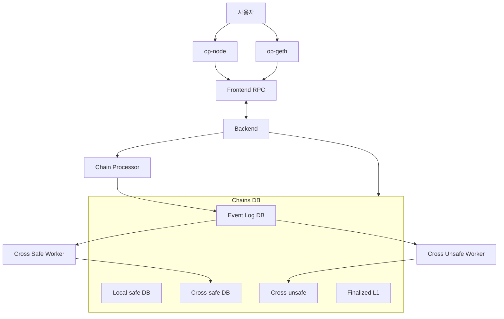
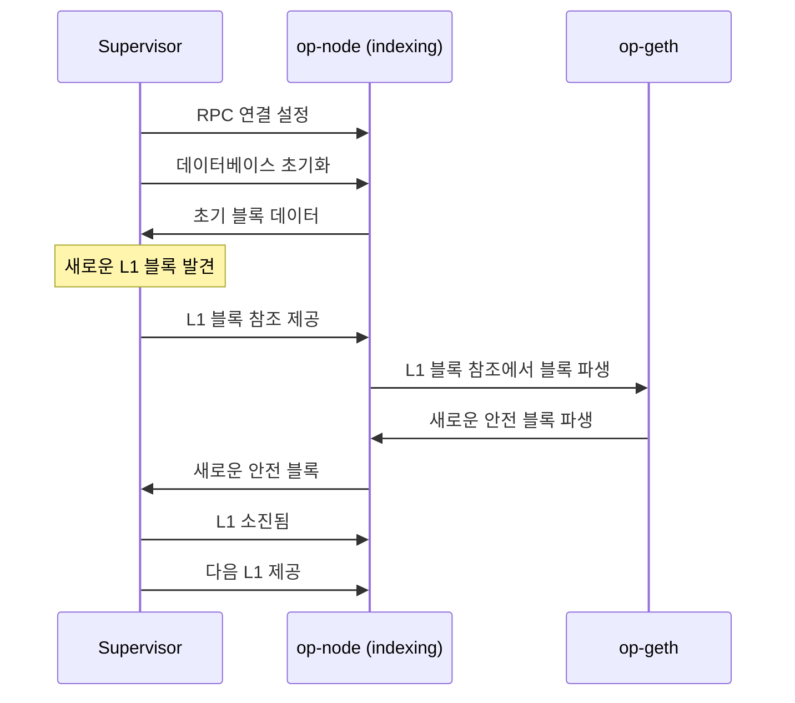
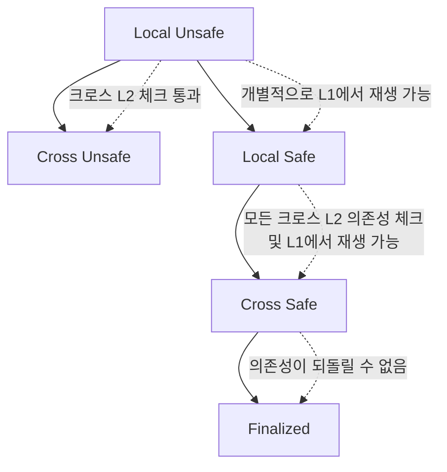

# Optimism Supervisor 상세 설명

## 개요

**Optimism Supervisor (op-supervisor)**는 **다중 L2 체인 간의 상호운용성(Interoperability)**을 위한 핵심 서비스입니다. 여러 L2 체인 간의 메시지 안전성을 모니터링하고 관리하는 역할을 담당합니다.

## 🎯 **Supervisor의 핵심 역할**

### 1. **크로스체인 메시지 안전성 보장**
```go
// Supervisor는 다음 3단계의 블록 안전성을 관리합니다
type BlockSafety struct {
    Unsafe    // 낙관적으로 처리된 블록
    Safe      // 유효한 의존성으로부터 재생 가능한 블록
    Finalized // 되돌릴 수 없는 의존성으로부터 재생 가능한 블록
}
```

### 2. **의존성 추적 및 관리**
- **Pre-interop**: DA(Data Availability)만이 의존성
- **Post-interop**: 다른 L2 체인들도 의존성이 됨
- **전역적 관점**: 크로스체인 메시지 안전성의 전역적 뷰 유지

## 🏗️ **Supervisor 아키텍처**

### 1. **핵심 컴포넌트**



### 2. **데이터베이스 구조**

#### **A. 이벤트 로그 데이터베이스**
```go
// 각 체인별로 로그 이벤트의 실행 목록 유지
type EventLogDB struct {
    ChainID    eth.ChainID
    BlockSeals []BlockSeal
    LogEvents  []LogEvent
}
```

#### **B. 로컬 안전 데이터베이스**
```go
// 각 체인별로 어떤 L2 블록이 어떤 L1 블록에서 로컬적으로 파생되었는지 저장
type LocalSafeDB struct {
    L2Block    common.Hash
    L1Block    common.Hash
    DerivedAt  time.Time
}
```

#### **C. 크로스 안전 데이터베이스**
```go
// 모든 L2 데이터가 주어졌을 때 어떤 L2 블록이 크로스 안전이 되었는지 저장
type CrossSafeDB struct {
    L2Block    common.Hash
    L1Block    common.Hash
    CrossSafeAt time.Time
}
```

## 🔄 **동작 모드**

### 1. **Indexing Mode (인덱싱 모드)**

#### **A. 특징**
- **제어권 이양**: 노드가 derivation 프로세스의 일부 제어권을 Supervisor에 이양
- **동기화 관리**: Supervisor가 노드의 동기화 상태를 관리
- **데이터 일관성**: 모든 인덱싱 노드가 동일한 L1 체인을 공유하도록 보장

#### **B. 제어 흐름**


#### **C. 이벤트 처리**
| op-node 이벤트 | Supervisor 제어 |
|----------------|-----------------|
| 새로운 unsafe 블록 추가 | Supervisor가 영수증을 가져와 데이터베이스 인덱싱 |
| L1 블록에서 새로운 safe 블록 파생 | Supervisor가 L1:L2 파생 정보를 데이터베이스에 기록 |
| L1 블록이 완전히 파생됨 | Supervisor가 다음 L1 블록 제공 |
| 노드의 derivation 파이프라인 리셋 | Supervisor가 데이터베이스에 알려진 블록을 타겟으로 리셋 신호 제공 |

### 2. **Following Mode (팔로잉 모드)**

#### **A. 특징**
- **독립적 동작**: op-node가 Supervisor 없이도 derivation과 L1 발견을 처리
- **주기적 업데이트**: Supervisor를 주기적으로 호출하여 크로스 헤드 업데이트
- **영향 없음**: 팔로잉 노드는 Supervisor의 데이터에 영향을 주지 않음

#### **B. 장점**
- **최소 인프라**: 여러 노드와 Supervisor의 큰 인프라 없이도 크로스 안전성 팔로잉 가능
- **낙관적 팔로잉**: 크로스 안전성을 낙관적으로 팔로잉

## 📊 **블록 안전성 단계**

### 1. **Local Unsafe**
- **정의**: 로컬에서 처리하기에 충분하지만 보장이 없는 블록
- **의존성**: 크로스 L2 체크 없음

### 2. **Cross Unsafe**
- **정의**: L2 의존성이 충족되었지만 DA는 여전히 누락된 블록
- **의존성**: 유효한 메시징 그래프 형성

### 3. **Local Safe**
- **정의**: 로컬 L2 체인 내용을 재생하기에 충분하지만 크로스 L2 상호작용에 대해서는 추론할 수 없는 블록
- **의존성**: DA 의존성 충족

### 4. **Cross Safe**
- **정의**: L2와 DA 의존성이 모두 충족된 블록
- **의존성**: 모든 L2 데이터를 재생하기에 충분한 L1 블록에서 파생

### 5. **Finalized**
- **정의**: 의존성이 되돌릴 수 없게 유효해진 블록
- **의존성**: L1에서 최종화된 블록



## 🔧 **Supervisor 설정 및 실행**

### 1. **기본 실행**
```bash
make op-supervisor

./bin/op-supervisor \
  --datadir="./op-supervisor-data" \
  --dependency-set="./my-network-configs/dependency-set.json" \
  --l2-rpcs="ws://example1:8545,ws://example2:8545" \
  --rpc.enable-admin \
  --rpc.port=8545
```

### 2. **주요 설정 옵션**
```yaml
# Supervisor 설정 예시
datadir: "./op-supervisor-data"           # 인덱싱된 interop 데이터 저장 위치
dependency-set: "./dependency-set.json"   # 체인 의존성 설정 파일
l2-rpcs: "ws://example1:8545,ws://example2:8545"  # L2 RPC 엔드포인트
rpc:
  enable-admin: true                      # 관리자 RPC 활성화
  port: 8545                              # RPC 포트
```

## 🎯 **Supervisor의 장점**

### 1. **크로스체인 안전성**
- **전역적 관점**: 여러 L2 체인 간의 메시지 안전성 보장
- **의존성 추적**: 복잡한 크로스체인 의존성을 정확히 추적
- **일관성 보장**: 모든 노드가 동일한 상태를 공유

### 2. **확장성**
- **다중 체인 지원**: 여러 L2 체인을 동시에 관리
- **모듈화된 아키텍처**: 각 체인별로 독립적인 프로세서
- **효율적인 데이터베이스**: 병렬 읽기와 O(1) 쓰기 지원

### 3. **유연성**
- **다양한 모드**: Indexing Mode와 Following Mode 지원
- **점진적 도입**: 기존 시스템에 점진적으로 통합 가능
- **호환성**: 기존 op-node와 완전 호환

## ⚠️ **주의사항**

### 1. **개발 상태**
- **Work in Progress**: 현재 활발히 개발 중인 기능
- **실험적 기능**: 프로덕션 환경에서 사용 시 주의 필요
- **지속적 업데이트**: 사양과 구현이 지속적으로 업데이트됨

### 2. **인프라 요구사항**
- **최소 노드 수**: 체인당 최소 1개의 인덱싱 노드 필요
- **리소스 요구**: 데이터베이스와 메모리 사용량 고려
- **네트워크 의존성**: L1과 L2 RPC 연결 필요

## 🚀 **향후 발전 방향**

### 1. **완전 온체인화**
- **의존성 설정**: 현재 파일 기반에서 온체인으로 전환
- **자동화**: 더 많은 자동화된 관리 기능 추가

### 2. **성능 최적화**
- **데이터베이스 최적화**: 더 효율적인 데이터베이스 구조
- **병렬 처리**: 더 많은 병렬 처리 기능

### 3. **확장성 향상**
- **더 많은 체인**: 더 많은 L2 체인 지원
- **분산 처리**: 분산된 Supervisor 네트워크

## 📋 **결론**

**Optimism Supervisor는 다중 L2 체인 환경에서 크로스체인 메시지의 안전성을 보장하는 핵심 서비스**입니다.

### ✅ **주요 특징**
1. **크로스체인 안전성**: 여러 L2 체인 간의 메시지 안전성 보장
2. **유연한 아키텍처**: Indexing Mode와 Following Mode 지원
3. **효율적인 데이터 관리**: 최적화된 데이터베이스 구조
4. **확장 가능한 설계**: 다중 체인 지원 및 모듈화

### 🎯 **활용 방안**
1. **다중 L2 환경**: 여러 L2 체인을 운영하는 환경
2. **크로스체인 애플리케이션**: 체인 간 상호작용이 필요한 애플리케이션
3. **안전성 중심 시스템**: 높은 안전성이 요구되는 시스템

Supervisor는 **Optimism의 Superchain 비전을 실현하는 핵심 기술**로, 다중 L2 체인 환경에서 안전하고 효율적인 크로스체인 상호작용을 가능하게 합니다.
