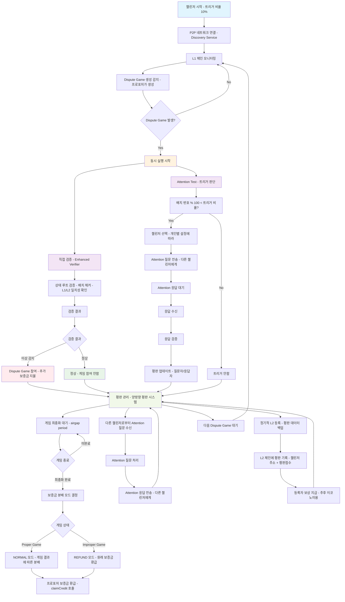

# Attention Test 통합 계획

## 🔄 서비스 플로우

Attention Test 시스템의 전체 서비스 플로우는 다음과 같습니다:

1. **챌린저 네트워크 연결**: 챌린저들이 P2P 네트워크에 참여하여 서로를 발견하고 연결
2. **Dispute Game 모니터링 및 검증**: L1 체인을 모니터링하여 새로운 Dispute Game 발생 감지, Dispute Game 발생 시 Enhanced Verifier를 통한 검증 수행
3. **Attention Test 트리거**: Dispute Game이 발생하면 개인화된 비율에 따라 Attention Test 실행, 평판관리
4. **게임 참여**: 검증 결과가 틀렸을 경우 Dispute Game에 참여



## 📋 개요

기존 P2P 챌린저 기본 구현에 Attention Test 프로토콜을 확장하여 챌린저들이 서로에게 지속적으로 어텐션하고 있는지 확인하고, Optimistic Rollups의 검증자 무임승차 문제를 해결합니다.


### 🔄 **최근 설계 변경사항**
- **개인화된 트리거 시스템**: 기존 0.28% 고정 확률에서 각 챌린저별 트리거 비율 설정으로 변경
- **배치 번호 기준 비율**: 배치 번호 % 100 < 트리거 비율로 간단하고 정확한 트리거
- **개인 최적화**: 각 챌린저가 자신의 평판점수, 리소스 상황, 목표에 맞게 트리거 비율 조정 가능

## 🎯 Attention Test 프로토콜 기본 플로우 (컨트랙트 없이, Attention Test Controller 없이)

### **1단계: 챌린저 네트워크 참여**
- 챌린저들이 P2P 네트워크에 참여
- 서로를 발견하고 연결 (Discovery Service)
- 챌린저 등록 및 상태 공유

### **2단계: 어텐션 테스트 트리거**
- **각 챌린저**가 개인화된 설정으로 배치 번호 기준 트리거 결정 (개인별 트리거 비율 설정)
- **간단한 비율 계산**: 배치 번호 % 100 < 트리거 비율 → 트리거 실행
- **정확한 비율 달성**: 10% 설정 시 배치 번호 끝자리가 0-9일 때 정확히 트리거
- **트리거 실행 방법**:
  - **L2 배치 이벤트 모니터링 (주된 동작)**: L2 배치가 L1에 제출될 때 이벤트를 모니터링하여 자동 트리거
  - **운영자 수동 트리거 (보조 동작)**: 운영자가 특정 챌린저에게 수동으로 트리거 발생
- 선택된 챌린저에게 **다른 챌린저들의 어텐션 확인 테스트** 출제
- 테스트에는 **다른 챌린저들의 상태, 평판, 활동성**에 대한 질문 포함
- **다른 챌린저들에게 어텐션하고 있지 않으면 답할 수 없는 문제**로 무임승차 방지

### **3단계: 챌린저 응답**
- 선택된 챌린저가 **다른 챌린저들 어텐션 테스트**에 응답
- **다른 챌린저들의 상태, 평판, 활동성 정보**를 기반으로 답변
- **다른 챌린저들에게 어텐션하고 있다면** 올바른 답변 제출 가능
- **다른 챌린저들에게 어텐션하지 않았다면** 답할 수 없어 평판 하락

### **4단계: 결과 처리 및 양방향 평판 관리**
- **응답자 평판**: 응답하지 않거나 잘못된 응답 시 점수 하락, 정확한 응답 시 점수 상승
- **질문자 평판**: 적극적으로 테스트를 수행하고 질문을 할수록 점수 상승
- **종합 평판**: 질문자와 응답자 점수를 종합하여 네트워크 내 지위 결정
- **공정성 보장**: 모든 챌린저가 동등한 기회로 테스트를 받고 수행

## 🛡️ DDoS 공격 방어 시스템

### **보안 위협 분석**
RAT 시스템은 P2P 네트워크 기반으로 동작하므로 다음과 같은 DDoS 공격에 취약할 수 있습니다:

1. **어텐션 질문 스팸 공격**: 악의적 챌린저가 과도한 어텐션 질문 전송
2. **P2P 네트워크 플러딩**: 대량의 가짜 챌린저 노드로 네트워크 포화
3. **평판 시스템 조작**: 협조된 공격으로 평판 데이터 조작
4. **리소스 고갈 공격**: 메모리, CPU, 네트워크 대역폭 소모

### **경제적 보안 모델: L2 스테이킹 볼트**

#### **스테이킹 기반 챌린저 등록**
```
챌린저 등록 프로세스:
1. L2 스테이킹 볼트에 최소 1 ETH 예치
2. 챌린저 공개키 등록 및 검증
3. 스테이킹 잠금 (30일 언봉딩 기간)
4. 네트워크 참여 권한 획득
```

#### **동등 권한 시스템**
- **모든 스테이킹 참여자**: 동일한 네트워크 권한 (100개 동시 연결, 시간당 10개 질문)
- **최소 스테이킹**: 1 ETH 이상 스테이킹 시 네트워크 참여 가능
- **공정성 보장**: 스테이킹 금액과 관계없이 모든 챌린저가 동등한 기회

#### **슬래싱 메커니즘**
```
페널티 등급:
- 경미한 위반 (스팸, 과도한 요청): 스테이킹 5% 삭감 + 7일 제재
- 중간 위반 (담합, 거짓 응답): 스테이킹 25% 삭감 + 30일 제재
- 심각한 위반 (DDoS 공격, 시스템 파괴): 스테이킹 100% 몰수 + 영구 차단
```

### **다층 방어 시스템**

#### **1. 네트워크 레벨 방어**
- **레이트 리미팅**: 챌린저별 메시지 전송 제한 (초당 10개)
- **연결 제한**: 모든 챌린저 동일한 연결 수 제한 (100개 동시 연결)
- **IP 기반 제한**: 동일 IP에서 최대 3개 챌린저 연결

#### **2. 어플리케이션 레벨 방어**
- **메시지 서명**: 모든 메시지에 공개키 기반 디지털 서명 필수
- **질문 빈도 제한**: 어텐션 질문 쿨다운 시간 적용
- **평판 기반 필터링**: 평판 50점 미만 챌린저의 메시지 우선순위 하향

#### **3. 합의 기반 방어**
- **질문 합의**: 어텐션 질문 전파 시 51% 이상 동의 필요
- **평판 합의**: 평판 변경 시 네트워크 합의 필요
- **슬래싱 합의**: 심각한 위반 시 커뮤니티 투표를 통한 최종 결정

#### **4. 경제적 억제**
- **공격 비용**: 대규모 DDoS 공격 시 수십~수백 ETH 필요
- **즉시 처벌**: 악의적 행동 감지 시 실시간 스테이킹 삭감
- **재공격 방지**: 경제적 손실로 인한 지속적 공격 억제

### **자동화된 보안 모니터링**

#### **실시간 위협 탐지**
```go
// 의심스러운 패턴 감지 시스템
- 비정상적 메시지 패턴 감지 (burst traffic)
- 담합 그룹 식별 (coordinated behavior)
- 평판 조작 시도 감지 (reputation manipulation)
- 네트워크 리소스 이상 사용 감지
```

#### **자동 대응 메커니즘**
```go
// 자동 방어 시스템
- 임계값 초과 시 자동 레이트 리미팅 강화
- 의심스러운 노드 자동 격리
- 스테이킹 기반 자동 슬래싱 실행
- 긴급 상황 시 네트워크 보호 모드 활성화
```

### **복구 및 거버넌스**

#### **이의 제기 시스템**
- **자동 처벌에 대한 이의 제기**: 7일 내 이의 제기 가능
- **커뮤니티 투표**: 스테이킹 보유자들의 투표를 통한 최종 결정
- **증거 제출**: 악의적 행동 또는 오탐에 대한 증거 제출

#### **네트워크 복구**
- **화이트리스트 관리**: 검증된 챌린저들의 우선 복구
- **점진적 권한 회복**: 제재 후 단계적 권한 회복 과정
- **시스템 업그레이드**: 새로운 공격 패턴에 대한 방어 메커니즘 업데이트

### 추후 고려사항.
- 챌린저들의 주소정보와 평판점수가 주기적으로 기록이 되어야 함.
- 모니터링하고 있는 L2에 기록하는 것이 어떤지.. (가격저렴)
- 누가 기록할것이면. 그것이 정확한지에 대한 합의 필요.
- 온체인에 기록된 정보를 바탕으로 추후 보상 지급에 대한 이코노미 설계 (L2에 트랜잭션 실행해서 등록한 등록자에게 추가 보상고려)
- **스테이킹 볼트 거버넌스**: 스테이킹 파라미터 조정을 위한 DAO 거버넌스 시스템
- **크로스체인 보안**: 다른 L2 체인과의 상호 운용성 및 보안 고려


## 🔧 구현해야 할 모듈들

### **1. Distributed Attention Question System** (`p2p/attention/question.go`)
       ```go
       // 핵심 기능:
       - ShouldAskAttentionQuestion() // Dispute Game 번호 기반 질문 비율 계산
       - SelectRandomChallenger() // 결정적 무작위성 기반 챌린저 선택
       - BroadcastAttentionQuestion() // P2P 네트워크로 어텐션 질문 전파
       - CollectQuestionConsensus() // 질문 합의 수집 (51% 이상 동의 필요)
       - UpdatePeerList() // 챌린저 목록 관리 (추가/제거)
       - GetAvailableChallengerCount() // 사용 가능한 챌린저 수 조회
       - MonitorDisputeGameEvents() // Dispute Game 이벤트 모니터링 (자동 질문)
       - ShouldAskManualQuestion() // 수동 질문 가능 여부 확인
       - AskManualQuestion() // 운영자 수동 질문 실행 (특정 챌린저 지정)
       - ExecuteAttentionQuestion() // 어텐션 질문 실행
       - ValidateAttentionResponse() // 어텐션 응답 검증
       ```

### **2. Enhanced Verifier** (`op-challenger/verification/enhanced.go`)
       ```go
       // 핵심 기능:
       - ValidateL2StateRoot() // L2 상태 루트 검증
       - ValidateBatchData() // 배치 데이터 검증
       - ValidateL1L2Consistency() // L1/L2 일치성 검증
       - GetVerificationResult() // 통합 검증 결과 반환
       - BatchChecker() // L1/L2 배치 데이터 일치성 확인
       - ValidateBatchHash() // 배치 해시 검증
       - ValidateBatchOrder() // 배치 순서 검증
       - ClassifyVerificationResult() // 검증 결과 분류 (VALID/INVALID_STATE/INVALID_BATCH/INVALID_BOTH)
       ```

### **3. Hybrid Reputation Store** (`p2p/reputation/hybrid_store.go`)
       ```go
       // 핵심 기능:
       - StoreLocalReputation() // 로컬 LevelDB에 평판 데이터 저장
       - SyncPeerReputations() // P2P 네트워크를 통한 실시간 평판 동기화
       - BackupToL2Node() // L2 노드에 백업 (저비용, 높은 가용성)
       - BackupToIPFS() // 주기적 IPFS 백업 (장기 보관)
       - ProposeReputationUpdate() // 평판 변경 제안
       - CollectReputationConsensus() // 평판 변경 합의 수집
       - ValidateReputationBlock() // 평판 블록 검증
       - GetConsensusReputation() // 합의된 평판 데이터 조회
       - RestoreFromL2Backup() // L2 노드 백업에서 복원
       - RestoreFromIPFSBackup() // IPFS 백업에서 복원
       - RecordToL2Chain() // L2 체인에 평판 정보 기록 (추후 보상용)
       ```

### **4. Attention Test Handler** (`p2p/challenger/attention.go`)
       ```go
       // 핵심 기능:
       - HandleIncomingQuestion() // 수신된 어텐션 질문 처리
       - GetPeerAttentionInfo() // 다른 챌린저들의 어텐션 정보 수집
       - SubmitQuestionResponse() // 어텐션 질문 응답 제출
       - ValidateOwnResponse() // 자신의 응답 검증
       - CollectPeerStatus() // 다른 챌린저들의 상태 정보 수집
       - CollectPeerReputation() // 다른 챌린저들의 평판 정보 수집
       - CollectPeerActivity() // 다른 챌린저들의 활동성 정보 수집
       ```

### **5. Reputation Manager** (`p2p/reputation/manager.go`)
       ```go
       // 핵심 기능:
       - UpdateQuestionerScore() // 질문자 평판 점수 업데이트 (적극성, 질문 빈도)
       - UpdateResponderScore() // 응답자 평판 점수 업데이트 (응답성, 정확성, 속도)
       - GetCombinedScore() // 종합 평판 점수 조회
       - ApplyPenalty() // 페널티 적용 (응답 실패, 부정확한 응답)
       - ApplyReward() // 보상 적용 (정확한 응답, 적극적 참여)
       - CalculateFairnessScore() // 공정성 점수 계산
       - DetectCollusion() // 담합 탐지 및 위험도 계산
       - CalculateNodeAffinity() // 노드 간 밀접성 계산
       - SeparateColludingGroups() // 담합 그룹 분리
       - CalculateHonestyScore() // 정직성 점수 계산
       - DistributeSynergy() // 시뇨리지 분배 (정직성/성과 기반)
       - ValidateWithMultiLayer() // 다중 검증 계층을 통한 검증
       - RecordToL2ForReward() // L2에 기록하여 추후 보상 지급 준비
       ```

### **6. Peer Attention Validator** (`p2p/attention/validator.go`)
       ```go
       // 핵심 기능:
       - ValidatePeerAttention() // 다른 챌린저들의 어텐션 검증
       - CollectPeerInfo() // 다른 챌린저들의 정보 수집
       - VerifyAttentionResponse() // 어텐션 응답 검증
       - GetAttentionData() // 어텐션 데이터 조회
       - ValidatePeerStatus() // 다른 챌린저들의 상태 검증
       - ValidatePeerReputation() // 다른 챌린저들의 평판 검증
       - ValidatePeerActivity() // 다른 챌린저들의 활동성 검증
       ```

### **7. L2 Staking Vault** (`op-challenger/staking/vault.go`)
       ```go
       // 핵심 기능:
       - RegisterChallenger() // 스테이킹과 함께 챌린저 등록
       - ValidateStaking() // 스테이킹 금액 및 상태 검증
       - UpdateChallengerStatus() // 챌린저 상태 업데이트
       - SlashStaking() // 악의적 행동 시 스테이킹 일부 또는 전부 몰수
       - DetectMaliciousBehavior() // DDoS 공격, 스팸, 담합 감지
       - AppealPenalty() // 페널티에 대한 이의 제기
       - CommunityVoting() // 커뮤니티 투표를 통한 복구 결정
       ```

### **8. L2 Chain Recorder** (`p2p/l2/recorder.go`)
       ```go
       // 핵심 기능:
       - RecordChallengerInfo() // 챌린저 주소정보와 평판점수를 L2에 기록
       - RecordStakingInfo() // 스테이킹 정보 및 이력 기록
       - ValidateRecordAccuracy() // 기록된 정보의 정확성 검증
       - CollectRecordingConsensus() // 기록에 대한 합의 수집
       - PrepareRewardEconomy() // 온체인 기록 기반 보상 이코노미 준비
       - DistributeStakingReward() // 스테이킹 참여자에게 보상 분배
       - DistributeRecordingReward() // L2 트랜잭션 실행 등록자에게 추가 보상
       ```

### **9. DDoS Defense System** (`p2p/security/ddos_defense.go`)
       ```go
       // 핵심 기능:
       - RateLimitMessage() // 메시지 전송 빈도 제한
       - ValidateStakingAuth() // 스테이킹 기반 인증 검증
       - DetectSuspiciousPattern() // 의심스러운 패턴 감지
       - AutoSlashMaliciousNode() // 악의적 노드 자동 슬래싱
       - ManageBlacklist() // 블랙리스트 자동 관리
       - ActivateProtectionMode() // 네트워크 보호 모드 활성화
       - MonitorNetworkHealth() // 네트워크 상태 실시간 모니터링
       ```

## 🚀 구현 순서

### **Phase 1: 핵심 기능**
1. **Distributed Attention Question System** (완전 분산화된 어텐션 질문 시스템)
   - TODO 1.1: 기본 구조 설계
   - TODO 1.2: P2P 챌린저 네트워크 구축
   - TODO 1.3: 개인화된 질문 로직 구현
   - TODO 1.4: 챌린저 간 Attention 질문 시스템
   - TODO 1.5: 질문 수신 및 응답 처리 시스템
   - TODO 1.6: 수동 Attention 질문 실행
   - TODO 1.7: 단위 테스트

2. **Enhanced Verifier** (L2 상태 및 배치 데이터 통합 검증)
   - TODO 2.1: 통합 검증기 구조
   - TODO 2.2: 검증 프로세스
   - TODO 2.3: 결과 분류
   - TODO 2.4: 단위 테스트

### **Phase 2: 보안 및 스테이킹 시스템**
3. **L2 Staking Vault** (경제적 보안 모델)
   - TODO 3.1: 스테이킹 컨트랙트 구현
   - TODO 3.2: 챌린저 등록 시스템
   - TODO 3.3: 슬래싱 메커니즘

4. **DDoS Defense System** (다층 방어 시스템)
   - TODO 4.1: 네트워크 레벨 방어
   - TODO 4.2: 어플리케이션 레벨 방어
   - TODO 4.3: 자동화된 보안 모니터링

### **Phase 3: 고급 기능 구현**
5. **배치 검증 성능 최적화** (병렬 검증 및 캐싱 전략)
   - TODO 5.1: 병렬 검증
   - TODO 5.2: 캐싱 전략
   - TODO 5.3: 단위 테스트

### **테스트 및 최적화**
6. **보안 테스트** (TODO 6.1)
   - DDoS 공격 시뮬레이션
   - 스테이킹 시스템 테스트
   - 슬래싱 메커니즘 검증

7. **통합 테스트** (TODO 7.1)
   - 전체 RAT 플로우 테스트
   - 배치 데이터 검증 시스템 통합 테스트
   - 보안 시스템 통합 테스트
   - 성능 테스트

8. **성능 최적화** (TODO 8.1)
   - 메모리 사용량 최적화 (< 500MB)
   - CPU 사용률 최적화 (< 5%)
   - 배치 검증 성능 최적화 (< 1초)
   - 네트워크 보안 성능 최적화


## 🔗 기존 P2P 챌린저 시스템과의 통합

### **Discovery Service 확장**
- 기존 노드 발견 기능에 챌린저 등록 기능 추가
- 챌린저 상태 모니터링 및 업데이트

### **메시지 시스템 확장**
- RAT 관련 메시지 타입 추가 완료
- 어텐션 테스트 메시지 처리 로직 구현 필요

### **네트워크 관리 확장**
- 챌린저 평판 기반 네트워크 관리
- 비활성 챌린저 자동 제거

### **L2 가스비 최적화**
- 낮은 가스비로 빈번한 평판 업데이트 가능
- 실시간 평판 동기화 및 검증
- 비용 효율적인 RAT 테스트 실행
